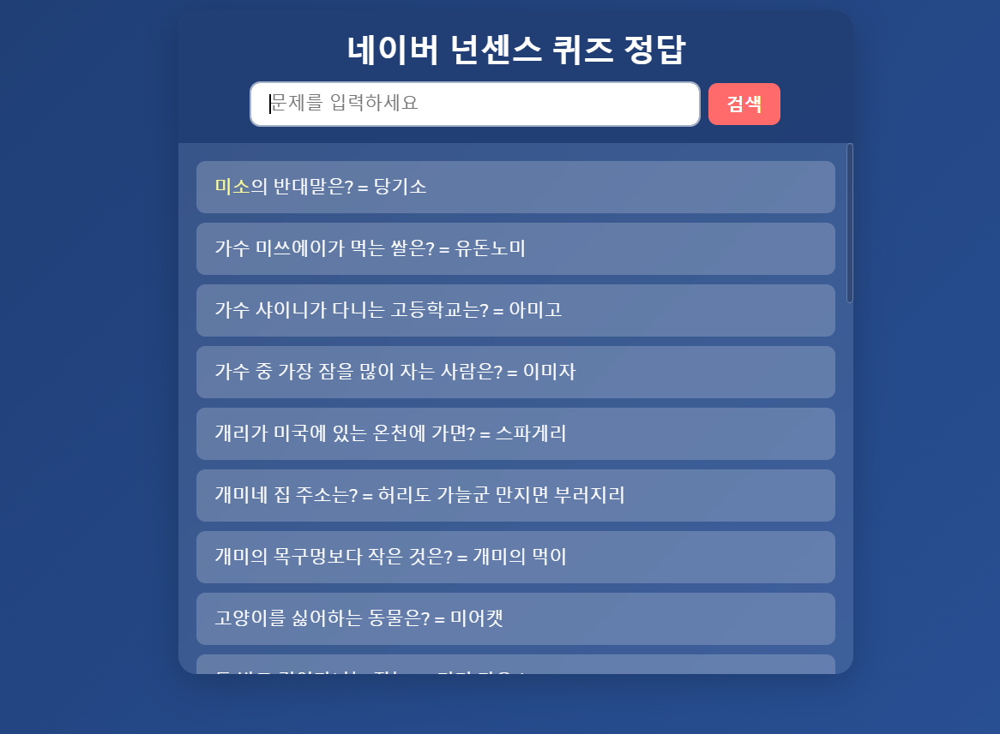

```
docker build -t quizanswer .
```
```
docker run -p 3010:3010 quizanswer
```
```
docker login

docker pull yourname/quizanswer:latest

docker run -d -p 3010:3010 yourname/quizanswer:latest

docker ps

docker stop <컨테이너_ID_or_이름>
```

